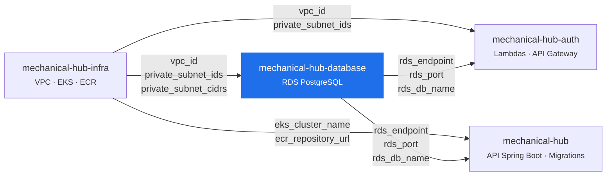
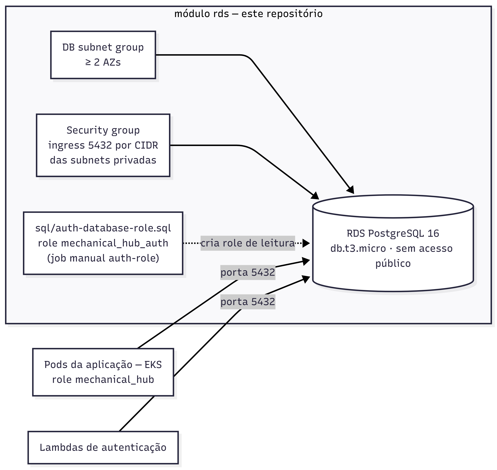

# mechanical-hub-database

Provisionamento da camada de persistência da plataforma Mechanical Hub: instância RDS PostgreSQL, DB subnet group e security group do banco, declarados em Terraform com state remoto próprio.

Este é um dos quatro repositórios da Fase 3. A divisão de responsabilidades está formalizada na ADR-0002 (`docs/architecture/adr/0002-divisao-responsabilidades-repositorios.md`, no repositório `mechanical-hub`).

---

## Recorte do repositório

Segundo a ADR-0002, o banco tem ciclo de vida próprio e é o recurso de maior criticidade e menor tolerância a recriação acidental. Isolá-lo em um repositório com pipeline próprio garante que um `terraform apply` de qualquer outro componente não tenha como afetá-lo.

**Pertence a este repositório:**

- Instância RDS PostgreSQL.
- DB subnet group.
- Security group do banco e suas regras de ingress.
- Definição do usuário/role de banco com privilégio mínimo usado pela autenticação (`sql/auth-database-role.sql`).

**Não pertence:**

| Recurso | Repositório |
| --- | --- |
| VPC, subnets, NAT/Internet Gateway | `mechanical-hub-infra` |
| Cluster EKS e node group | `mechanical-hub-infra` |
| Registro de imagens (ECR) | `mechanical-hub-infra` |
| Lambdas de autenticação e API Gateway | `mechanical-hub-auth` |
| Migrations do schema (Flyway) | `mechanical-hub` |

As migrations ficam junto do código que depende delas — este repositório provisiona o banco vazio, não o schema.

## Tecnologias

- **Terraform** >= 1.7.0, provider AWS ~> 5.0
- **AWS RDS PostgreSQL 16**, `db.t3.micro`, 20 GB, criptografado em repouso, sem acesso público
- **State remoto** em S3, chave `mechanical-hub-database/terraform.tfstate`
- **GitHub Actions** para validação, testes e apply
- **LocalStack** para os testes de integração

---

## Ordem de provisionamento



```
mechanical-hub-infra → mechanical-hub-database → mechanical-hub-auth → mechanical-hub
```

Cada repositório lê os valores de que precisa via `terraform_remote_state`, nunca por hardcode de IDs ou endpoints.

### Arquitetura interna deste repositório

O diagrama acima mostra a ordem entre repositórios; este mostra apenas os recursos que **este** repositório provisiona (módulo `rds`) e quem os consome:



### Aplicar fora de ordem falha — de propósito

Este repositório resolve `vpc_id`, `private_subnet_ids` e `private_subnet_cidrs` a partir do state do `mechanical-hub-infra`. Se esse state não existir e nenhum override for informado, o `plan` **falha na precondição de rede**, antes de qualquer recurso ser criado:

```
Nao foi possivel resolver a rede.

Aplique o mechanical-hub-infra primeiro e informe o state dele:
  -var="infra_state_bucket=mechanical-hub-tfstate-<conta>"

Ou passe os valores diretamente:
  -var="vpc_id=vpc-..." -var='private_subnet_ids=["subnet-a","subnet-b"]'

O DB subnet group exige ao menos duas subnets em AZs distintas.
```

A falha é deliberada. Sem ela, o Terraform tentaria criar um DB subnet group com lista vazia de subnets e devolveria um erro de API da AWS sem relação aparente com a causa real.

---

## Outputs de contrato

Os outputs são **interface pública e estável**. Alterá-los ou removê-los é mudança quebra-compatibilidade e exige coordenação com os consumidores, do mesmo modo que o schema da tabela `USERS` é contrato entre a aplicação e a Lambda (RFC-0003).

| Output | Descrição | Consumido por |
| --- | --- | --- |
| `rds_endpoint` | Hostname da instância, sem a porta | `mechanical-hub-auth` (`DATABASE_HOST`), pipeline de `mechanical-hub` (`DB_HOST`) |
| `rds_port` | Porta do banco (5432) | `mechanical-hub-auth`, pipeline de `mechanical-hub` |
| `rds_db_name` | Nome do banco PostgreSQL | `mechanical-hub-auth`, pipeline de `mechanical-hub` |
| `rds_endpoint_with_port` | Endpoint completo, `host:porta` | Conveniência para strings de conexão |
| `rds_username` | Usuário master | Operação e migrations. As aplicações usam roles dedicadas, não este usuário |
| `rds_identifier` | Identificador da instância | Operação, comandos da AWS CLI |
| `rds_arn` | ARN da instância | Políticas IAM, observabilidade |
| `rds_security_group_id` | Security group do banco | Diagnóstico de conectividade |
| `rds_subnet_group_name` | Nome do DB subnet group | Diagnóstico |
| `vpc_id` | VPC efetivamente usada | Depuração da resolução de rede |
| `private_subnet_ids` | Subnets do DB subnet group | Depuração da resolução de rede |

Os dois últimos existem para tornar visível qual caminho de resolução foi usado — remote state ou override.

Credenciais **não** transitam por output. `db_password` é injetada por secret e nunca é exportada.

---

## Execução local

### Pré-requisitos

- Terraform >= 1.7.0
- Credenciais AWS ativas (no AWS Academy Lab elas expiram a cada sessão)
- O `mechanical-hub-infra` já aplicado, ou os valores de rede em mãos

### Caminho recomendado — via remote state

```bash
cd infra

terraform init \
  -backend-config="bucket=mechanical-hub-tfstate-<ID_DA_CONTA>" \
  -backend-config="key=mechanical-hub-database/terraform.tfstate" \
  -backend-config="region=us-east-1"

export TF_VAR_db_password='<senha-do-usuario-master>'

terraform plan -var="infra_state_bucket=mechanical-hub-tfstate-<ID_DA_CONTA>"
terraform apply -var="infra_state_bucket=mechanical-hub-tfstate-<ID_DA_CONTA>"
```

Alternativamente, copie `terraform.tfvars.example` para `terraform.tfvars`, preencha `infra_state_bucket` e omita o `-var` nos comandos. O `terraform.tfvars` está no `.gitignore` — não versione o arquivo preenchido.

### Caminho de fallback — sem o repo `infra` aplicado

Enquanto o `mechanical-hub-infra` não existir, informe a rede diretamente. Os overrides têm precedência sobre o remote state:

```bash
terraform apply \
  -var='vpc_id=vpc-0123456789abcdef0' \
  -var='private_subnet_ids=["subnet-aaaa1111","subnet-bbbb2222"]' \
  -var='private_subnet_cidrs=["10.0.11.0/24","10.0.12.0/24"]'
```

As subnets precisam estar em **AZs distintas** — é exigência do DB subnet group, verificada pela precondição.

Este é um contorno de desenvolvimento. O caminho de produção é o remote state: a cada reset do Lab os IDs mudam, e passá-los à mão significa reeditar comandos e secrets a cada ciclo.

### Testes

```bash
cd infra
terraform init -backend=false

# Unitários — mock_provider, sem AWS e sem LocalStack
terraform test -filter=tests/unit/region_unit.tftest.hcl
terraform test -filter=tests/unit/network_unit.tftest.hcl
terraform test -filter=tests/unit/rds_unit.tftest.hcl

# Integração — exige LocalStack em http://localhost:4566
docker run --rm -d -p 4566:4566 localstack/localstack:3
terraform test -filter=tests/integration/rds_integration.tftest.hcl
```

`tests/fixtures/network/` cria uma VPC e duas subnets só para os testes de integração — este repositório não tem módulo de VPC, e não deveria ter.

---

## Pipelines

| Workflow | Gatilho | O que faz |
| --- | --- | --- |
| `ci.yml` → `validate` | PR e push em `main` | `fmt -check`, `init -backend=false`, `validate`, testes unitários |
| `ci.yml` → `integration` | PR e push em `main` | Testes de integração com LocalStack como service container |
| `ci.yml` → `plan` | PR em `main` | `plan` real contra a AWS, para revisão no PR |
| `deploy.yml` → `deploy` | Push em `main`, ou manual | `init`, `validate`, `plan`, `apply` e publicação dos outputs no step summary |
| `deploy.yml` → `auth-role` | Só manual, marcando `criar_role_de_autenticacao` | Executa `sql/auth-database-role.sql` contra o banco recém-provisionado |

O `deploy.yml` usa `concurrency` sem cancelamento: dois `terraform apply` simultâneos disputariam o mesmo state.

### Secrets exigidos

Configurar em **Settings → Secrets and variables → Actions**:

| Secret | Descrição |
| --- | --- |
| `AWS_ACCESS_KEY_ID` | Credencial da sessão do AWS Academy Lab |
| `AWS_SECRET_ACCESS_KEY` | Credencial da sessão do AWS Academy Lab |
| `AWS_SESSION_TOKEN` | Token de sessão — obrigatório no Lab, que só emite credenciais temporárias |
| `AWS_ACCOUNT_ID` | ID da conta, usado para compor o nome do bucket de state |
| `DB_PASSWORD` | Senha do usuário master do RDS, injetada como `TF_VAR_db_password` |
| `AUTH_DB_PASSWORD` | Senha da role `mechanical_hub_auth`. Só usada pelo job opcional `auth-role`; precisa coincidir com o `TF_VAR_database_password` do `mechanical-hub-auth` |

As credenciais do AWS Academy Lab **expiram a cada sessão**. Atualize os três primeiros secrets antes de rodar qualquer pipeline, ou o `configure-aws-credentials` falha com erro de token inválido.

---

## Decisões de arquitetura

### Liberação de acesso por CIDR, não por security group

O banco atende a dois consumidores: os pods da aplicação no EKS e as Lambdas de autenticação. As Lambdas são criadas no `mechanical-hub-auth`, aplicado **depois** deste repositório — referenciar o security group delas aqui criaria uma dependência circular entre repositórios.

A ADR-0002 resolveu liberando a porta 5432 pelos **CIDRs das subnets privadas**. Todos os consumidores residem nessas subnets, e o banco não é exposto publicamente (`publicly_accessible = false`).

A regra é gerada por `for_each` sobre `private_subnet_cidrs`, uma por CIDR. Há ainda `allowed_security_group_ids`, vazio por padrão, caso um dia se queira granularidade extra sem alterar a decisão principal.

**Contrapartida:** é menos granular do que liberar por security group de origem. Se a topologia mudar — cargas de trabalho não confiáveis passando a residir nas mesmas subnets privadas —, a decisão precisa ser revisitada.

### Sem RDS Proxy

A ADR-0002 prevê o RDS Proxy neste repositório "quando adotado". Ele não foi provisionado porque o AWS Academy Lab não libera os recursos de que ele depende (IAM dedicado e Secrets Manager), e as Lambdas de autenticação conectam direto ao endpoint do banco.

O ganho do Proxy — pooling de conexões diante do modelo de concorrência da Lambda — é real e relevante fora do laboratório. Fica como trabalho futuro: o output `rds_endpoint` continuaria sendo o ponto de entrada dos consumidores, passando a apontar para o Proxy em vez da instância, sem quebrar o contrato.

### Sem Multi-AZ e sem retenção de backup

`multi_az = false` e `backup_retention_period = 0` por restrição de custo do ambiente de laboratório, que é destruído e recriado a cada reset. Ambos são variáveis — em um ambiente real, `db_multi_az = true` e uma retenção de pelo menos 7 dias.

---

## Estrutura

```
sql/
└── auth-database-role.sql       # role de leitura usada pela autenticação
infra/
├── providers.tf                 # required_providers e backend S3
├── main.tf                      # remote state do infra, precondição de rede, chamada do módulo
├── variables.tf                 # variáveis e overrides de rede
├── outputs.tf                   # contrato entre repositórios
├── terraform.tfvars.example
├── modules/rds/                 # subnet group, security group, instância
└── tests/
    ├── unit/                    # mock_provider, sem AWS
    ├── integration/             # LocalStack
    └── fixtures/network/        # VPC mínima para os testes
```

## Referências

No repositório `mechanical-hub`:

- `docs/architecture/adr/0002-divisao-responsabilidades-repositorios.md` — divisão entre os quatro repositórios
- `docs/architecture/rfc/0003-autenticacao-funcionarios-lambda-authorizer-cpf.md` — contrato do schema com a autenticação
- `docs/architecture/rfc/0001-escolha-banco-de-dados-gerenciado.md` — escolha do PostgreSQL gerenciado
- `docs/specs/mechanical-hub-data-model.md` — modelo de dados
